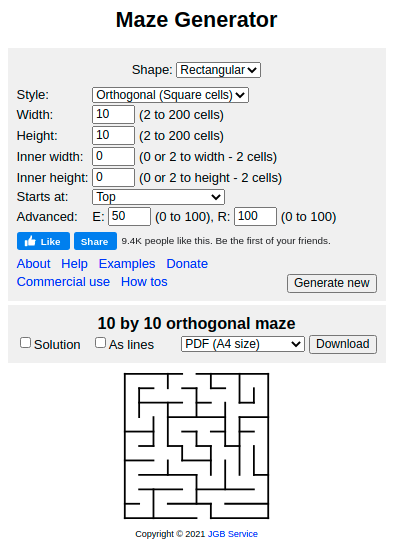
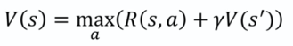
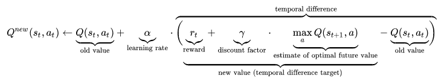

# Maze Solver using QTable Reinforcement Learning


There is many maze solving algorithm out there: http://www.astrolog.org/labyrnth/algrithm.htm#solve even very surprising ones, which i invite you to have a look at: https://www.crisluengo.net/archives/277/

The Idea was no to beat best solving algorithm but to get familiar with QTable learning applying it to maze solving.


## Maze Generator

Mazes can be generated using [mazegenerator.net](http://www.mazegenerator.net/) 

Simply select width and height, click generate and  download maze as png.



Restrictions: 

- for now, only rectangular orthogonal mazes are supported. I plan to be able to solve any type of maze...


## QLearning with QTable

There is plenty of very good articles on the web explaining in details QTable learning, so i will only concentrate on the basics and implementation:

I loved this one which is easy to understand and cristal clear: https://itnext.io/reinforcement-learning-with-q-tables-5f11168862c8


All is based on the Bellman's equation and Markov Decision Processes (MDP) giving the value of a state:



and derived from it the QValues (value of an action) update equation



### Pseudo code

```
# Training
initialize the QTable with reward values

repeat n times:
	- select a random allowed position on the maze
	- select a random possible direction (UP:DOWN:LEFT:RIGHT)
	- get the reward for this direction from this position
	- update the Qvalue for this direction from this position using above equation

# Playing
start from StartPosition

repeat until reaching the end:
	- Find the direction correspondinng to the max Qvalue at CurrentPosition
	- Move from CurrentPosition using direction found
	- update CurrentPosittion
```


### MyCode

Code is composed of 2 files:

- environment.py: to create the maze from the png and manage the display using pygame
- qTableLearning.py: actually creating the Qtable, updating it through training, and playing the result.


### Libraries used:

- pygame: for visual rendering

- Pillow for initial png transformations

- Numpy: for calculation

- Numba: for speeding up numpy calculation

  

### Results and Limitations

If repeating enough times during the training phase, algorithm works quite well.

I've been able to solve 20x20 maze within 5 seconds training.

To run the code

```
python qTablelearning.py --mazefilepath <PATH TO MAZE PNG>
```


 


But size of the maze is quickly limiting the algorithm. I've not been able to solve a 50x50 maze within acceptable amount of time.